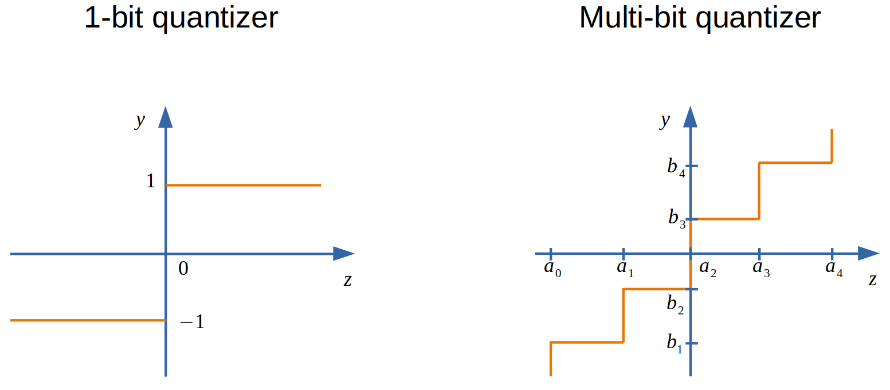

# Bayesian Massive MIMO Channel Estimation with Parameter Estimation using Low-Resolution ADCs
* We aim to recover massive MIMO channels from quantizated measurments produced by low-reolution ADCs, we adopt the `AMP with built-in parameter estimation` (**AMP-PE**) [1,2] to solve this problem.
* AMP-PE offers a much simpler way to estimate the distribution parameters, which allows us to directly work with true quantization noise models.
{width=100%}

* This package contains code files to implement the approach described in the following paper.
```
@INPROCEEDINGS{CE_AMP_PE:2021,
    author={S. Huang and D. Qiu and T. D. Tran},
    booktitle={Proceedings of IEEE ICASSP},
    title={Bayesian Massive MIMO Channel Estimation with Parameter Estimation using Low-Resolution ADCs},
    year={2021},
    month={June}
}
```
If you use this package and find it helpful, please cite the above paper. Thanks :smile:


## Summary
```
    ./src          -- This folder contains MATLAB files to recover the massive MIMO channel from quantized measurements.
    ./demo         -- This folder contains demo files to run experiments in the paper, detailed comments are within each demo file.
```
## Usage

You can follow the following steps to run the program. Detailed comments are within each demo file.


Open `MATLAB` and type the following commands into the console:

```
    >> addpath(genpath('./'))
    >> noisy_channel_estimation_1bit
    >> noisy_channel_estimation_2bit
    >> noisy_channel_estimation_3bit
```


## Reference

[1] S. Huang and T. D. Tran, "Sparse signal recovery using generalized approximate message passing with built-in parameter estimation," in Proceedings of IEEE ICASSP, March 2017, pp. 4321–4325.

[2] S. Huang, D. Qiu, and T. D. Tran, "1-bit compressive sens-ing via approximate message passing with built-in parameterestimation," arXiv:2007.07679, 2020.
